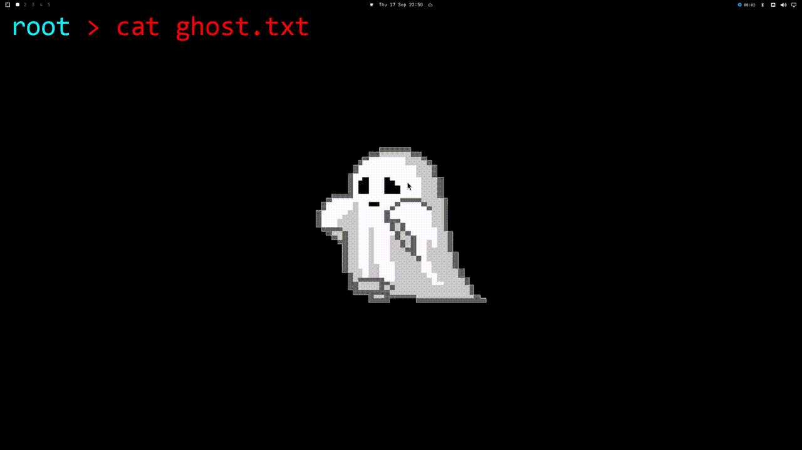

# Better Recast — GPU Screen Recording Plugin for Omarchy

GPU-accelerated screen recording for the Omarchy shell, backed by
[gpu-screen-recorder](https://git.dec05eba.com/gpu-screen-recorder/about/) with
automatic hardware and encoder detection.



## Features

- One-click record/stop from the bar widget (left click toggle, right click panel)
- **Volume sliders** for desktop audio and microphone (applied via PipeWire/wpctl)
- **Audio device selectors** for desktop and mic (fed by `gpu-screen-recorder --list-audio-devices`, drive gsr's `-a` capture sources directly)
- **Audio codec (AAC/Opus) and bitrate** control (0–512 kbps, auto when 0)
- **Noise gate** via FFmpeg's `afftdn`+`agate` filter
- **Webcam overlay** for recordings and streams: enable/disable, device, size — composited into the capture (`-w target|/dev/video0`, bottom-right)
- **Portal session restore** (`-restore-portal-session`) persists your Wayland portal session across recordings
- **Instant replay** (third mode): rolling buffer of the last N seconds stored in RAM or on disk (CBR for predictable RAM) — save a clip from the panel button or the **S** key, then the buffer restarts
- **Low-power capture** (AMD): reduces GPU clocks and switches to content-aware frame mode
- **Auto-optimized encoder settings** based on detected GPU vendor + available codecs:
  - NVIDIA — HEVC (H.265) → H.264 fallback, VBR, very-high, performance tune
  - AMD / Intel — AV1 → HEVC → H.264, VBR, very-high/high, performance tune
  - CPU fallback — H.264, QP, medium
- Hardware probing via `gpu-screen-recorder --info` (primary) with DRM/nvidia-smi fallbacks
- Region picking (`omarchy-capture-region`), monitor selection, or window/portal capture
- Pause / resume over the GSR unix-socket IPC (`scripts/gsr-ipc.py`)
- Runtime settings persisted inline to `~/.config/omarchy/shell.json` (entry `pix.recast`)
- Compatible with stock indicators via `/tmp/omarchy-screenrecord-filename`
- Save/failure notifications via `omarchy-notification-send`

## Requirements

- Omarchy 4.x (Quickshell 0.3+)
- `gpu-screen-recorder` (≥ 6.0) with a matching GPU driver
- `omarchy-capture-region`, `omarchy-notification-send` (bundled with Omarchy)
- `python3` for the IPC client

## Install

```
omarchy plugin add https://github.com/pxllbt/Better-Recast.git --enable
omarchy plugin enable pix.recast
omarchy-shell shell toggle pix.recast   # open the control panel
omarchy-shell bar layout right add pix.recast   # add the bar indicator
```

## Update

The control panel checks for updates automatically (~6h interval) and shows a banner when a new version is available. You can also check manually from the panel or run:

```
omarchy plugin update pix.recast
```

This fetches the latest changes from `origin/main`, shows a diff, and fast-forwards the checkout after validation. Updates are always manual and require your confirmation.

## Development

```
omarchy plugin validate .   # manifest + entry point check
bash tests/smoke.sh         # headless QML load smoke test
```

## Files

| Path | Purpose |
| --- | --- |
| `manifest.json` | Plugin manifest (schema v1, service + bar-widget) |
| `Service.qml`   | Backend: hardware probe, recording state machine, GSR process/IPC |
| `BarWidget.qml` | Bar indicator: state + elapsed, click to record/stop, right-click panel |
| `Panel.qml`     | Floating control panel: target, settings, hardware, diagnostics |
| `Config.js`     | Normed config model + per-vendor encoder profile rules |
| `GpuProbe.js`   | `gpu-screen-recorder --info` parser + fallbacks |
| `scripts/gsr-ipc.py` | Unix-socket JSON IPC client for pause/resume/stop |

## License

MIT — see [LICENSE](LICENSE).
